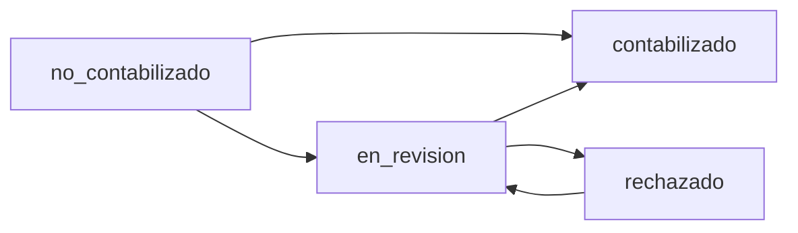
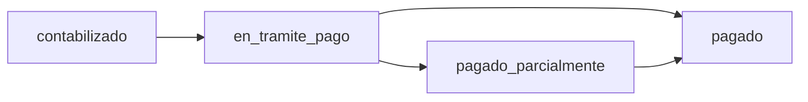
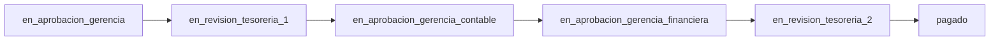
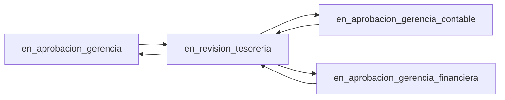

# Flujos De Estado

Fecha de referencia: 2026-06-08.

Este documento resume los estados vigentes de `facturas` y `tramites_pago`. La fuente de verdad tecnica esta en:

- `backend/domain/facturas.js`
- `backend/domain/tramitesPago.js`
- `backend/services/tramitesPagoWorkflowStatePolicies.js`
- `backend/services/tramitesPagoWorkflowDecisionPolicies.js`
- `frontend/src/utils/estadosFactura.js`
- `frontend/src/utils/estadosTramite.js`
- `frontend/src/utils/tramiteWorkflow.js`

## Regla Principal

No mezclar estado documental de factura con workflow de pago.

El sistema conserva tres dominios para historial de facturas:

- `contabilizacion`: estados propios de revision y contabilizacion.
- `workflow_pago`: estados derivados del tramite y pago.
- `mixto`: transiciones que cruzan dominios o no se pueden clasificar en uno solo.

Una mejora estructural puede mover codigo entre servicios, repositorios o helpers, pero no debe cambiar el significado de estos dominios sin una decision explicita de arquitectura y pruebas de contrato.

## Facturas

Fuente principal: `backend/domain/facturas.js`.

### Estados Vigentes

| Estado | Dominio | Uso esperado |
| --- | --- | --- |
| `no_contabilizado` | `contabilizacion` | Estado inicial o factura sin revision contable completa. |
| `en_revision` | `contabilizacion` | Factura guardada como borrador/revision contable. |
| `contabilizado` | `contabilizacion` | Factura contabilizada/finalizada. |
| `rechazado` | `contabilizacion` | Factura rechazada en flujo contable/documental. |
| `en_tramite_pago` | `workflow_pago` | Factura incluida en tramite de pago. |
| `pagado_parcialmente` | `workflow_pago` | Factura con pago parcial registrado por tramite. |
| `pagado` | `workflow_pago` | Factura pagada. |

### Transiciones Contables

Estas transiciones se originan normalmente desde contabilizacion:

Notas:

- `workflow_action` en contabilizacion acepta `save_draft`, `mark_in_review` y `finalize`.
- El use case de contabilizacion actualiza `facturas.estado` y registra historial cuando el estado cambia.
- Si una factura contabilizada entra a tramite, el flujo de pago debe quedar trazado como `workflow_pago`.

### Transiciones De Pago

Estas transiciones se originan normalmente desde tramite de pago:

Notas:

- Al marcar un tramite como `pagado`, el backend actualiza facturas segun saldos.
- Si hay saldos restantes, la factura puede quedar `pagado_parcialmente`.
- No sumar ni comparar saldos sin conservar `moneda`.

## Tramites De Pago

Fuente principal: `backend/domain/tramitesPago.js`.

### Estados Vigentes Del Tramite

| Estado | Descripcion operativa |
| --- | --- |
| `en_aprobacion_gerencia` | Aprobacion inicial de gerencia. |
| `en_revision_tesoreria_1` | Revision inicial de tesoreria y caratulas. |
| `en_aprobacion_gerencia_contable` | Aprobacion de gerencia contable. |
| `en_aprobacion_gerencia_financiera` | Aprobacion financiera. |
| `en_revision_tesoreria_2` | Tesoreria para pago. |
| `pagado` | Tramite pagado. |
| `cancelado` | Tramite cancelado. |
| `en_revision_tesoreria` | Estado de retorno/revision de tesoreria usado cuando una decision rechaza y devuelve el tramite. |

### Flujo Principal

Fuente frontend para proxima accion visible: `frontend/src/utils/tramiteWorkflow.js`.

### Retornos Por Rechazo

Cuando una decision por documento queda `rechazado`, la politica por defecto devuelve el tramite a `en_revision_tesoreria`.

Notas:

- `DESTINOS_TESORERIA` permite reenviar a gerencia, gerencia contable o gerencia financiera.
- El rechazo registra historial con accion `devolver_tesoreria`.

### Reglas De Avance

Fuente: `backend/services/tramitesPagoWorkflowStatePolicies.js`.

| Estado destino | Validacion antes de avanzar | Efecto posterior |
| --- | --- | --- |
| `en_aprobacion_gerencia_contable` | Etapa `gerencia` lista y caratulas resueltas. | Persiste montos de pago programado por factura. |
| `en_aprobacion_gerencia_financiera` | Etapa `gerencia_contable` lista. | Sin efecto especial documentado. |
| `en_revision_tesoreria_2` | Etapa `financiera` lista. | Sin efecto especial documentado. |
| `pagado` | Requiere `DOCUMENTOS_TRAMITAR_PAGO`, etapa financiera lista y sin rechazados activos. | Registra pagos principales, actualiza estados de facturas por saldo, marca retenciones/documentos de tesoreria como pagados. |

## Decisiones Por Documento

Fuente: `backend/domain/tramitesPago.js`, `backend/services/tramitesPagoWorkflowEtapaPolicies.js`.

Etapas soportadas:

| Etapa | Columna estado | Columna motivo | Accion de historial |
| --- | --- | --- | --- |
| `gerencia` | `estado_gerencia` | `motivo_gerencia` | `decision_gerencia` |
| `gerencia_contable` | `estado_gerencia_contable` | `motivo_gerencia_contable` | `decision_gerencia_contable` |
| `financiera` | `estado_financiero` | `motivo_financiero` | `decision_financiera` |

Decisiones soportadas:

- `aprobado`
- `rechazado`

Estados por documento:

- `pendiente`
- `aprobado`
- `rechazado`

## Tesoreria Por Documento

Fuente: `backend/domain/tramitesPago.js`.

Acciones soportadas:

- `reenviar`
- `excluir`
- `devolver_contabilidad`
- `reincluir`

Estados de tesoreria:

- `pendiente`
- `excluido`
- `devuelto_contabilidad`
- `reenviado`
- `reincluido`
- `pagado`

Notas:

- `rechazo-tesoreria` es legacy y se trata como exclusion.
- `devuelto_contabilidad` no debe confundirse con rechazo final de factura.
- `reincluir` permite volver a considerar un documento excluido/devuelto segun reglas del use case.

## Caratulas

Las caratulas son obligatorias en estados donde tesoreria y aprobaciones posteriores dependen de evidencia documental. La validacion bloqueante actual ocurre al avanzar hacia `en_aprobacion_gerencia_contable`.

Estados donde la caratula se considera requerida segun soporte actual:

- `en_revision_tesoreria`
- `en_revision_tesoreria_1`
- `en_aprobacion_gerencia_contable`
- `en_aprobacion_gerencia_financiera`
- `en_revision_tesoreria_2`
- `pagado`

## Checklist Antes De Cambiar Estados

1. Confirmar si el cambio toca `facturas.estado`, estado del tramite o estado por documento.
2. Revisar `backend/domain/facturas.js` y `backend/domain/tramitesPago.js`.
3. Revisar politicas de avance/rechazo en `backend/services/tramitesPagoWorkflow*.js`.
4. Revisar labels frontend en `frontend/src/utils/estadosFactura.js` y `frontend/src/utils/estadosTramite.js`.
5. Revisar dashboard/reportes si el estado aparece en agregados.
6. Si toca pagos o saldos, revisar `docs/principios_transversales.md`.
7. Agregar o actualizar tests de reglas antes de cerrar.
